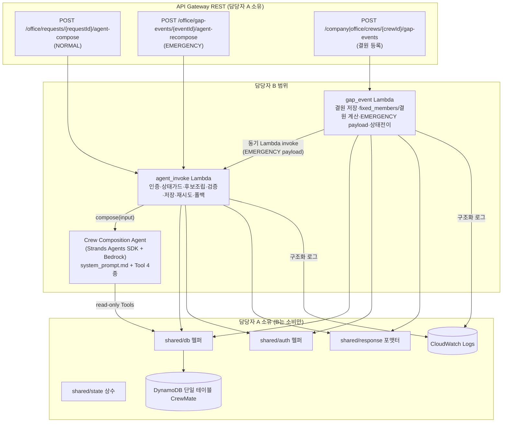
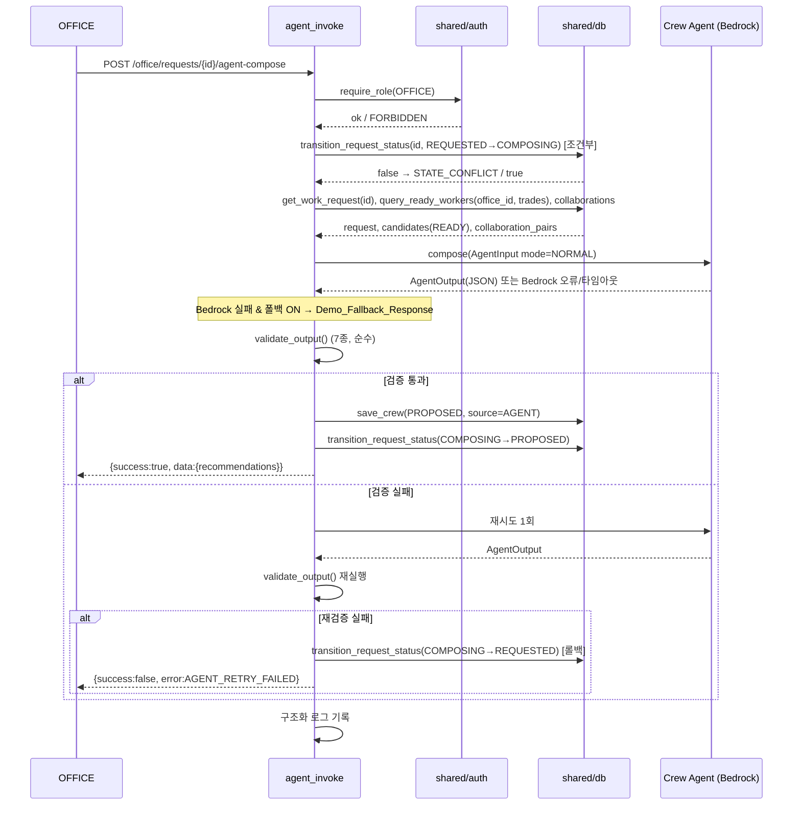
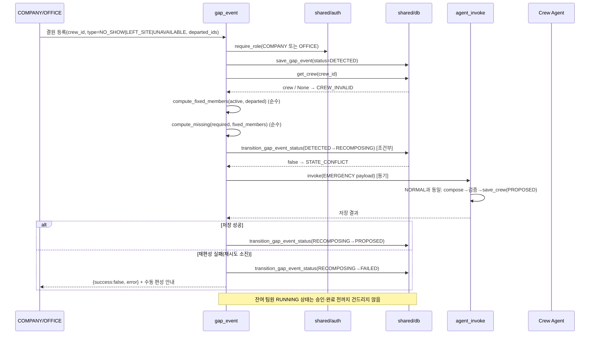
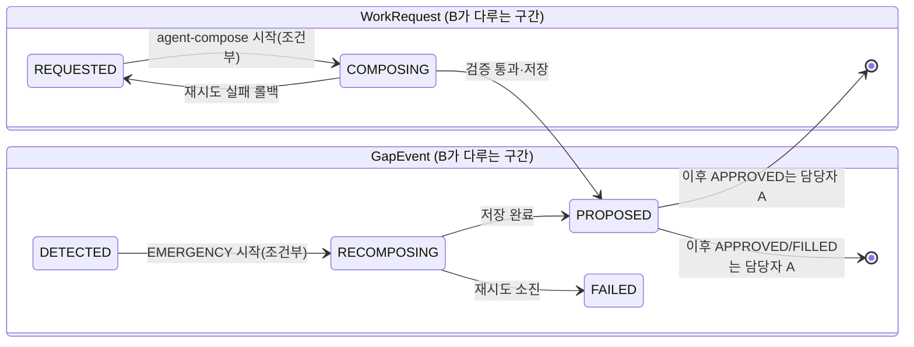

# Design Document — Crew Composition Agent (담당자 B)

## Overview

이 설계는 CrewMate의 담당자 B 범위인 **Crew Composition Agent + Agent Invoke Lambda + Gap Event Lambda + Agent 관측성**을 정의한다. `requirements.md`의 12개 요구사항을 실제 레포 구조(`README.md` 7절)와 공유 계약(`PRD_A_BACKEND.md` 1절)에 정합하도록 구체화한다.

핵심 설계 원칙:

- **단일 Agent**: NORMAL(일반 편성)과 EMERGENCY(긴급 재편성)를 하나의 동일한 `Crew_Composition_Agent`가 `mode` 필드로 분기 처리한다. 별도 긴급 Agent·별도 ML 모델은 만들지 않는다. (Req 1, 금지 1·2)
- **Human-in-the-Loop**: Agent는 조회·추천만 한다. 실제 배정·상태 전이(READY→RESERVED→RUNNING)와 승인은 담당자 A의 API가 수행하며, 본 범위는 추천안을 `Crew(status=PROPOSED, source=AGENT)`로 저장만 한다. (Req 8, 금지 4·6)
- **조회 전용 Tool**: Agent에는 쓰기 계열 Tool을 절대 제공하지 않는다. 4종 read-only Tool만 노출하고, 주 실행 경로는 Lambda가 후보를 미리 조립해 단일 호출로 전달한다. (Req 5)
- **LLM 신뢰 금지 / 코드 검증**: Agent 출력은 7종 코드 검증을 통과해야만 저장된다. 검증은 순수 함수로 구현해 결정적으로 판정한다. (Req 7)
- **shared 헬퍼 소비만**: DB·권한 접근은 담당자 A의 `backend/shared/*` 헬퍼를 통해서만 수행한다. 테이블·인덱스에 직접 접근하지 않으며, DynamoDB 테이블·Cognito·코어 API를 정의하지 않는다. (범위 밖)
- **데모 안정성**: 검증 실패 시 1회 재시도, Bedrock 실패·타임아웃 시 폴백 플래그로 사전 준비된 데모 응답을 반환한다. (Req 9)

### 이 설계가 다루지 않는 것 (Non-Goals)

DynamoDB 테이블/GSI 정의, Cognito, 코어 API(worker/company/office/assignment/notification), 승인·배정·상태 전이 로직, React 화면, SageMaker/확률 예측 ML, 긴급 전용 별도 Agent. 위 항목은 담당자 A·C의 범위이며 본 설계는 그 산출물(shared 헬퍼, 승인 API)을 **소비**한다.

## Architecture

### 컴포넌트 구성



### 실행 경계 (누가 무엇을 하는가)

| 관심사                                      | 담당자 B (본 설계)                     | 담당자 A (소비 대상)             |
| ------------------------------------------- | -------------------------------------- | -------------------------------- |
| 후보 조회(office_id + READY)                | `shared/db` 헬퍼를 **호출**            | GSI1 쿼리 헬퍼 **제공**          |
| Agent 추천 생성/검증                        | 구현                                   | —                                |
| Crew(PROPOSED, source=AGENT) 저장           | `shared/db` 헬퍼로 **저장**            | 저장 헬퍼 **제공**               |
| WorkRequest/GapEvent 상태 전이(조건부 쓰기) | 오케스트레이션 **주도**, 헬퍼 **호출** | 조건부 쓰기 헬퍼 **제공**        |
| 워커 state 전이(READY→RESERVED→RUNNING)     | **하지 않음**                          | 승인 API에서 수행                |
| 승인/배정                                   | **하지 않음**                          | `/office/.../approve`            |
| 권한 확인                                   | `shared/auth` 헬퍼를 **호출**          | Cognito claim 검증 헬퍼 **제공** |

### 주 실행 경로: 사전 조립(pre-assembly) 우선

Req 5.7 및 PRD F-B3의 폴백 단순화 지침에 따라, **주 경로는 Lambda가 후보 데이터를 미리 조립해 Agent 입력 payload에 담아 단일 호출로 전달**한다. 이 방식은 Tool 왕복으로 인한 지연·비결정성·데모 리스크를 줄인다.

- 4종 read-only Tool은 Req 5.1을 충족하기 위해 **정의·등록**되며, Agent가 보조 정보(예: 특정 워커 이력)를 추가로 필요로 할 때 사용할 수 있다.
- 그러나 기본 동작은 `agent_invoke`가 `get_ready_workers`/`get_request_detail`/`get_worker_history`/`get_current_crew`에 해당하는 데이터를 **미리 조립**해 `AgentInput`으로 전달하고, Agent는 제공된 입력만으로 추천을 생성한다.
- 이로써 Agent의 DB 접근면이 최소화되고(조회 전용 Tool조차 주 경로에서는 거의 호출되지 않음), 검증·재현성이 높아진다.

### NORMAL 편성 시퀀스



### EMERGENCY(긴급 재편성) 시퀀스



## Components and Interfaces

레포 구조(`README.md` 7절)에 따른 B 소유 모듈 배치:

```text
agent/
├── crew_agent.py          # Agent 정의(Strands + Bedrock), compose() 진입점
├── system_prompt.md       # Agent 제약 프롬프트 (Req 4)
├── schemas.py             # Pydantic 입출력 스키마 (AgentInput/AgentOutput 등) — B 소유 계약
└── tools/
    ├── __init__.py        # Tool 등록 (정확히 4종, read-only)
    ├── get_request_detail.py
    ├── get_ready_workers.py
    ├── get_worker_history.py
    └── get_current_crew.py

backend/functions/agent_invoke/
├── handler.py             # Lambda 진입점: 라우팅(NORMAL/EMERGENCY), 인증, 상태가드
├── assembler.py           # 후보 조립(office_id + READY), collaboration_pairs 구성
├── validator.py           # 7종 코드 검증 (순수 함수)
├── persistence.py         # Crew(PROPOSED, source=AGENT) 저장, WorkRequest 상태 전이
├── fallback.py            # Demo_Fallback_Response 결정적 로컬 컴포저
└── observability.py       # 구조화 CloudWatch 로그 (PII 제외)

backend/functions/gap_event/
├── handler.py             # Lambda 진입점: 인증, GapEvent 저장/전이, agent_invoke 호출
├── gap_logic.py           # fixed_members·결원 직종/인원 계산 (순수 함수)
└── emergency_payload.py   # EMERGENCY AgentInput 조립 (순수 함수)
```

> 패키징: `agent/schemas.py`의 입출력 스키마는 `agent_invoke`·`gap_event`가 공통 소비하므로 SAM 빌드 시 공용 Lambda Layer(또는 각 함수 빌드에 포함)로 패키징한다. `validator.py`는 `agent_invoke` 전용이다.

### 1. Crew Composition Agent (`agent/crew_agent.py`)

Strands Agents SDK로 정의한 단일 Agent. Amazon Bedrock 모델을 백엔드로 사용한다.

```python
def build_agent(fallback_enabled: bool = False) -> Agent:
    """system_prompt.md를 로드하고 4종 read-only Tool을 등록한 Agent를 생성."""

def compose(agent_input: AgentInput, *, timeout_s: float) -> AgentOutput:
    """
    AgentInput(mode 포함)을 받아 Agent를 실행하고 JSON만 파싱해 AgentOutput 반환.
    - mode=NORMAL: request/candidates 기반 조합 추천
    - mode=EMERGENCY: fixed_members 유지 + candidates에서 결원 보충
    - Bedrock 오류/타임아웃은 BedrockUnavailable 예외로 표준화하여 상위(agent_invoke)에 전달
    - 모델이 JSON 외 텍스트를 섞어 반환하면 파싱 단계에서 실패로 처리(→ 검증 실패 경로)
    """
```

- 모델은 `mode`에 따라 프롬프트 지시가 분기하지만 **동일한 Agent 인스턴스**를 사용한다. (Req 1.1)
- Agent는 `candidates`/`fixed_members`에 없는 `worker_id`를 만들지 않도록 프롬프트로 지시하되, 최종 보장은 `validator.py`가 코드로 수행한다. (Req 1.6, 7.2)
- 출력은 지정 스키마의 JSON만 반환한다. (Req 2.7)

### 2. Agent System Prompt (`agent/system_prompt.md`)

Req 4의 11개 제약을 모두 포함한다. 최소 항목:

1. 제공된 후보 목록에 없는 근로자를 만들거나 추천하지 않는다. (4.2)
2. 신규 후보는 READY 상태 근로자만 사용한다. (4.3)
3. NORMAL: 요청 조건을 충족하는 작업조를 구성한다. (4.4)
4. EMERGENCY: `fixed_members`를 유지하고 부족 인원을 `candidates`에서 보충한다. (4.5)
5. 필수 직종·인원 제약을 반드시 준수한다. (4.6)
6. 비용·숙련도·협업 이력·요청 우선순위를 종합 판단한다. (4.7)
7. 개인 나열이 아닌 전체 팀 조합을 평가한다. (4.8)
8. 결과는 지정된 JSON 스키마로만 반환한다. (4.9)
9. 최종 배정이나 상태 변경을 수행하지 않는다. (4.10)
10. 추천 사유는 업무 정보 중심으로 간결하게, 근로자 부정 표현 없이 작성한다. (4.11)
11. 확률 수치·"최적 보장" 류 표현을 사용하지 않는다. (Req 3.4)

### 3. Agent Tools (`agent/tools/`) — 정확히 4종, 조회 전용

| Tool                 | 입력                           | 출력                            | 요구사항 |
| -------------------- | ------------------------------ | ------------------------------- | -------- |
| `get_request_detail` | `request_id`                   | 요청 상세 조건                  | 5.2      |
| `get_ready_workers`  | `office_id, required_trades[]` | 해당 사무소 READY 후보          | 5.3      |
| `get_worker_history` | `worker_ids[]`                 | 제한된 작업·협업 이력           | 5.4      |
| `get_current_crew`   | `crew_id`                      | 현재/활성 멤버, 결원, 요구 조건 | 5.5      |

- 모든 Tool은 `shared/db`의 **읽기 헬퍼만** 호출한다. 테이블 직접 접근 없음.
- 쓰기 계열 Tool(`update_worker_state`, `approve_crew`, `assign_worker`, `mark_running`, `delete_worker`, `update_company_request`)은 **등록하지 않는다**. Agent가 접근할 수 있는 Tool 레지스트리에는 위 4종만 존재한다. (Req 5.6)
- `get_worker_history`가 반환하는 이력에는 개인정보 전체가 아니라 판단에 필요한 필드(협업 횟수, 완료 건수 등)만 포함한다.

### 4. Agent Invoke Lambda (`backend/functions/agent_invoke/`)

라우팅: 두 진입 경로 모두 동일 Lambda가 처리하되 `mode`를 결정한다.

- `POST /office/requests/{requestId}/agent-compose` → `mode=NORMAL` (Req 6.1)
- `POST /office/gap-events/{eventId}/agent-recompose` → `mode=EMERGENCY` (Req 6.2), gap_event Lambda가 조립한 EMERGENCY payload로 호출

핵심 함수(개념적 시그니처):

```python
# handler.py
def handler(event, context) -> dict:
    """라우팅 → 권한 확인 → 상태 가드 → compose_flow() → shared/response 포맷."""

# assembler.py
def assemble_normal_input(request_id: str, office_id: str) -> AgentInput:
    """get_work_request + query_ready_workers(office_id, trades) + collaborations 조립."""

# validator.py  (순수 함수 — I/O 없음)
def validate_output(output: AgentOutput, ctx: ValidationContext) -> ValidationResult:
    """7종 검증을 모두 수행하고 실패 사유 목록을 반환. 어떤 검증도 통과 못하면 invalid."""

# persistence.py
def save_proposal(recommendation: Recommendation, ctx: SaveContext) -> str:
    """Crew(status=PROPOSED, source=AGENT) 저장 후 WorkRequest status=PROPOSED 전이. crew_id 반환."""

# fallback.py
def demo_fallback(agent_input: AgentInput) -> AgentOutput:
    """조립된 candidates로부터 결정적 로컬 컴포저가 추천 생성 (LLM 미사용)."""

# 오케스트레이션
def compose_flow(agent_input: AgentInput, ctx) -> Result:
    """compose → (Bedrock 실패&폴백 → demo_fallback) → validate → (실패 시 1회 재시도) → save/roll-back."""
```

`compose_flow`의 실행 규칙:

1. `compose()` 호출. **Bedrock 실패/타임아웃**이면서 폴백 플래그가 켜져 있으면 `demo_fallback()` 결과로 대체한다. (Req 9.3, 9.4)
2. `validate_output()` 실행. 통과 시 `save_proposal()` 후 성공 응답. (Req 7, 8)
3. 검증 실패 시 결과 폐기 + 오류 로그 + **Agent 1회 재시도**. (Req 9.1)
4. 재시도 후에도 실패면 `AGENT_OUTPUT_INVALID`를 기록하고 `AGENT_RETRY_FAILED`를 반환하며, NORMAL이면 WorkRequest를 `COMPOSING→REQUESTED`로 롤백해 수동 편성이 가능하도록 한다. (Req 9.2)

### 5. 상태 가드 & 동시성 제어

WorkRequest/GapEvent의 상태 전이를 **조건부 쓰기(ConditionExpression)** 로 수행해 상태 가드와 중복 요청 방지를 동시에 달성한다. (Req 6.6, 6.7, 10)

- NORMAL 시작: `REQUESTED → COMPOSING` 조건부 전이. 실패하면(이미 COMPOSING/PROPOSED 등) `STATE_CONFLICT`. 이미 처리 중인 동일 요청의 후속 호출은 조건 실패로 자연히 거부된다(큐잉하지 않음).
- EMERGENCY 시작: gap_event가 `DETECTED → RECOMPOSING` 조건부 전이로 락 역할. 실패 시 `STATE_CONFLICT`.
- 성공 종료: `COMPOSING → PROPOSED`(WorkRequest) / `RECOMPOSING → PROPOSED`(GapEvent).
- 상태 전이 자체는 `shared/db`의 조건부 쓰기 헬퍼를 통해 수행한다(워커 state 전이는 A의 승인 API 소관, 본 범위는 요청/이벤트의 오케스트레이션 상태만 다룸).



### 6. Gap Event Lambda (`backend/functions/gap_event/`)

```python
# handler.py
def handler(event, context) -> dict:
    """인증(COMPANY/OFFICE) → GapEvent 저장(DETECTED) → 영향 Crew 조회
       → fixed_members/결원 계산 → RECOMPOSING 전이 → agent_invoke 동기 호출
       → 저장 성공 시 PROPOSED / 실패 시 FAILED + 수동 안내."""

# gap_logic.py  (순수 함수)
def compute_fixed_members(active_members: list[Member], departed_ids: set[str]) -> list[Member]:
    """활성 멤버에서 이탈자를 제외한 잔여 정상 팀원(RUNNING 유지)."""

def compute_missing(required_workers: list[TradeReq], fixed_members: list[Member]) -> list[TradeReq]:
    """요구 직종/인원에서 잔여 팀원 커버분을 뺀 결원 직종/인원."""

# emergency_payload.py  (순수 함수)
def build_emergency_payload(request, fixed_members, candidates, collaboration_pairs) -> AgentInput:
    """mode=EMERGENCY AgentInput 조립."""
```

- 이탈자 제외 목록은 계산만 하고 워커 state는 변경하지 않는다. (Req 10.3)
- 잔여 팀원은 `fixed_members`가 되며 승인·완료 전까지 RUNNING을 유지한다. (Req 10.4, 10.8)
- 영향 Crew 조회 실패/무효 → `CREW_INVALID`. (Req 10.11)
- `agent-recompose`의 eventId에 매칭되는 GapEvent가 없으면 `GAP_EVENT_NOT_FOUND`. (Req 10.10)
- gap 등록 자체는 COMPANY·OFFICE 모두 허용한다. (Req 11.3)

### 7. 권한 (`shared/auth` 소비)

- `agent_invoke`(compose/recompose 트리거): OFFICE 역할만 허용. 그 외 역할은 권한 오류(FORBIDDEN). COMPANY가 Agent를 직접 실행하려 하면 거부. (Req 11.1, 11.2, 11.4)
- `gap_event`(결원 등록): COMPANY·OFFICE 모두 허용. (Req 11.3)
- 역할·office_id는 `shared/auth`가 Cognito claim에서 추출한 값을 사용한다.

### 8. 소비하는 shared 계약 (담당자 A 제공 — 본 범위는 호출만)

아래는 본 설계가 **의존하는 인터페이스**다. 시그니처는 담당자 A와 확정해야 하는 통합 지점이며, 미제공 시 A와 조율한다. B는 이 헬퍼들 밖에서 테이블에 직접 접근하지 않는다.

| 헬퍼                                                         | 용도                                      | 사용처                                 |
| ------------------------------------------------------------ | ----------------------------------------- | -------------------------------------- |
| `db.get_work_request(request_id)`                            | 요청 상세 조회                            | assembler, get_request_detail          |
| `db.query_ready_workers(office_id, trades=None)`             | GSI1 READY 후보 조회                      | assembler, get_ready_workers           |
| `db.get_workers(worker_ids)`                                 | 배치 조회(state, current_crew_id 포함)    | validator 컨텍스트, get_worker_history |
| `db.get_worker_collaborations(worker_ids)`                   | 협업 이력(collaboration_pairs)            | assembler, get_worker_history          |
| `db.get_crew(crew_id)`                                       | 현재 작업조 조회                          | gap_event, get_current_crew            |
| `db.save_crew(crew_item)`                                    | Crew(PROPOSED, source=AGENT) 저장         | persistence                            |
| `db.transition_request_status(request_id, expected, target)` | 조건부 상태 전이(bool)                    | 상태가드, persistence                  |
| `db.save_gap_event(gap_item)`                                | GapEvent 저장(DETECTED)                   | gap_event                              |
| `db.transition_gap_event_status(event_id, expected, target)` | 조건부 상태 전이(bool)                    | gap_event                              |
| `auth.require_role(event, roles)`                            | 역할·claim 검증                           | 두 Lambda 진입점                       |
| `state.*`                                                    | 상태 enum 상수(READY/RUNNING/PROPOSED 등) | 전 범위                                |
| `response.ok(data)` / `response.error(code, msg)`            | `{success,...}` 응답 포맷                 | 두 Lambda 진입점                       |

## Data Models

모든 입출력·검증 모델은 **Pydantic**으로 정의해 파싱·검증·직렬화를 일관되게 처리한다. Agent 출력은 반드시 `AgentOutput`으로 파싱되며, 파싱 실패는 곧 검증 실패다.

### Agent 입력 스키마 (`agent/schemas.py`)

```python
class Priority(BaseModel):
    cost: Literal["LOW", "MEDIUM", "HIGH"]
    skill: Literal["LOW", "MEDIUM", "HIGH"]
    teamwork: Literal["LOW", "MEDIUM", "HIGH"]

class TradeRequirement(BaseModel):
    trade: str          # FORMWORK | REBAR | MASONRY | MATERIAL_CARRY | GENERAL ...
    count: int          # 필요 인원 (>0)

class RequestSpec(BaseModel):
    request_id: str
    required_workers: list[TradeRequirement]
    budget: int
    priority: Priority
    site: str
    work_date: str      # ISO8601 date
    start_time: str

class Candidate(BaseModel):
    worker_id: str
    trade: str
    skill_level: int          # 1~5
    desired_daily_wage: int
    certifications: list[str] = []
    career_years: int

class FixedMember(BaseModel):
    worker_id: str
    trade: str
    desired_daily_wage: int   # total_cost 계산 일관성을 위해 포함

class CollaborationPair(BaseModel):
    worker_a: str
    worker_b: str
    count: int

class AgentInput(BaseModel):
    mode: Literal["NORMAL", "EMERGENCY"]
    request: RequestSpec
    fixed_members: list[FixedMember] = []      # EMERGENCY에서만 채워짐
    candidates: list[Candidate]
    collaboration_pairs: list[CollaborationPair] = []
```

### Agent 출력 스키마 (`agent/schemas.py`)

```python
class Recommendation(BaseModel):
    rank: int
    member_ids: list[str]
    total_cost: int
    reason: str
    considerations: list[str]

class AgentOutput(BaseModel):
    mode: Literal["NORMAL", "EMERGENCY"]
    request_id: str
    recommendations: list[Recommendation]   # 1~3개 (검증에서 개수·제약 확인)
```

### 검증 컨텍스트 & 결과 (`backend/functions/agent_invoke/validator.py`)

검증을 **순수 함수**로 만들기 위해, I/O로 미리 확보한 상태 스냅샷을 컨텍스트로 주입한다.

```python
class WorkerStateSnapshot(BaseModel):
    worker_id: str
    state: str                      # READY/RESERVED/RUNNING/...
    current_crew_id: str | None
    # 다른 RESERVED/RUNNING 배정 포함 여부 판정에 사용

class ValidationContext(BaseModel):
    mode: Literal["NORMAL", "EMERGENCY"]
    candidates: list[Candidate]
    fixed_members: list[FixedMember]
    required_workers: list[TradeRequirement]
    worker_states: dict[str, WorkerStateSnapshot]   # 추천된 worker_id → 스냅샷
    current_crew_id: str | None = None              # EMERGENCY 시 재편성 대상 crew (check 6 예외)
    trade_by_worker: dict[str, str]                 # worker_id → trade (후보/고정 통합)
    wage_by_worker: dict[str, int]                  # worker_id → desired_daily_wage

class CheckResult(BaseModel):
    check: str          # "member_exists" | "new_ready" | "no_dup" | "trade_headcount"
                        # | "total_cost" | "no_conflict_assignment" | "fixed_preserved"
    passed: bool
    detail: str = ""

class ValidationResult(BaseModel):
    valid: bool
    checks: list[CheckResult]       # 실패 항목 추적용
```

### GapEvent 처리 모델 (`backend/functions/gap_event/`)

```python
class Member(BaseModel):
    worker_id: str
    trade: str
    desired_daily_wage: int
    state: str          # RUNNING(정상)/이탈 대상 등

class GapEventInput(BaseModel):
    crew_id: str
    type: Literal["NO_SHOW", "LEFT_SITE", "UNAVAILABLE"]
    departed_ids: list[str]

class GapComputation(BaseModel):
    fixed_members: list[FixedMember]
    missing: list[TradeRequirement]
    excluded: list[str]             # 이탈자(계산만, state 변경 없음)
```

### 관측성 로그 레코드 (`backend/functions/agent_invoke/observability.py`)

```python
class AgentLogRecord(BaseModel):
    agent_execution_id: str         # 실행별 UUID
    agent_mode: Literal["NORMAL", "EMERGENCY"]
    request_id: str
    input_candidate_count: int
    recommendation_count: int
    validation_passed: bool
    validation_failed_checks: list[str] = []
    retried: bool
    fallback_used: bool
    saved: bool                     # 최종 저장 여부
    crew_id: str | None = None
    # PII(name/phone 등) 미포함 — worker_id만 사용
```

- 로그에는 근로자 이름·전화번호 등 개인정보 전체를 넣지 않는다. worker_id·집계 수치만 남긴다. (Req 12.2)

### Demo Fallback 응답 (`backend/functions/agent_invoke/fallback.py`)

- `demo_fallback(agent_input)`은 LLM 없이 **결정적 로컬 컴포저**로 동작한다: 필요 직종별로 후보를 저비용 우선 정렬해 예산 내에서 채우고(EMERGENCY는 `fixed_members` 포함), `AgentOutput` 형태로 반환한다.
- 폴백 결과도 동일한 `validate_output()`을 통과해야 저장된다(방어적). 시드 데이터(seed=42) 기준으로 결정적 결과를 내므로 데모에서 안정적이다.
- 대안으로 시드 워커 ID에 고정된 정적 fixture를 둘 수 있으나, 라이브 후보와 불일치 시 검증 실패 위험이 있어 **결정적 로컬 컴포저를 1순위 설계**로 채택한다(사용자 확인 요청 대상).

## Correctness Properties

_프로퍼티(property)는 시스템의 모든 유효한 실행에서 참이어야 하는 특성·동작으로, 시스템이 무엇을 해야 하는지에 대한 형식적 진술이다. 프로퍼티는 사람이 읽는 명세와 기계로 검증 가능한 정확성 보장 사이의 다리 역할을 한다._

본 기능의 핵심 순수 로직은 **7종 출력 검증기(`validator.py`)**, **입출력 스키마(파싱/직렬화)**, **결원 계산(`gap_logic.py`)**, **폴백 컴포저(`fallback.py`)** 이며, 이들에 대해 아래 프로퍼티를 정의한다. 검증기는 I/O로 미리 확보한 `ValidationContext`(워커 상태 스냅샷 포함)를 주입받는 순수 함수이므로, 100회 이상 반복하는 속성 기반 테스트에 적합하다. Agent(LLM) 자체의 생성 품질(1.7 등)과 shared/db·Bedrock 연동은 프로퍼티 대상이 아니며 예시/통합 테스트로 다룬다.

### Property 1: 멤버 출처(provenance) 강제

_For any_ Agent 출력과 검증 컨텍스트에 대해, 어떤 추천안의 `member_ids`에 `candidates`와 `fixed_members` 어디에도 존재하지 않는 `worker_id`가 하나라도 포함되면, 검증기는 그 출력을 반드시 거부한다.

**Validates: Requirements 7.2, 1.6**

### Property 2: 신규 멤버는 READY 상태

_For any_ Agent 출력과 워커 상태 스냅샷에 대해, `fixed_members`가 아닌 신규 추천 멤버 중 상태가 READY가 아닌 워커가 하나라도 있으면, 검증기는 그 출력을 반드시 거부한다.

**Validates: Requirements 7.3, 1.8**

### Property 3: 추천안 내 중복 멤버 금지

_For any_ Agent 출력에 대해, 어떤 추천안의 `member_ids`에 중복된 `worker_id`가 존재하면, 검증기는 그 출력을 반드시 거부한다.

**Validates: Requirements 7.4**

### Property 4: 필수 직종·인원 충족과 추천안 개수

_For any_ 요청 조건(required_workers)과 Agent 출력에 대해, 검증기가 유효로 판정하는 것은 (a) 추천안 개수가 1개 이상 3개 이하이고, (b) 각 추천안이 직종별 필요 인원을 정확히 충족할 때에 한한다. 직종·인원이 미달·초과이거나 추천안이 0개 또는 4개 이상이면 반드시 거부한다.

**Validates: Requirements 7.5, 1.4**

### Property 5: total_cost는 서버 계산 임금 합과 일치

_For any_ 추천안에 대해, `total_cost`가 그 `member_ids`의 `desired_daily_wage` 서버 계산 합과 정확히 일치할 때에만 이 검사를 통과하며, 값이 다르면 검증기는 반드시 거부한다.

**Validates: Requirements 7.6**

### Property 6: 타 RUNNING/RESERVED 배정과 비충돌

_For any_ Agent 출력과 워커 상태 스냅샷에 대해, 신규 추천 멤버 중 (현재 재편성 대상 Crew를 제외한) 다른 RUNNING 또는 RESERVED 배정에 이미 포함된 워커가 하나라도 있으면, 검증기는 그 출력을 반드시 거부한다. EMERGENCY의 `fixed_members`(현재 Crew에서 RUNNING 유지)는 이 검사에서 예외로 취급한다.

**Validates: Requirements 7.7**

### Property 7: EMERGENCY에서 fixed_members 보존

_For any_ mode=EMERGENCY인 Agent 출력에 대해, 검증기가 유효로 판정하는 것은 모든 추천안이 모든 `fixed_members`의 `worker_id`를 빠짐없이 그대로 포함할 때에 한한다. 어떤 추천안이라도 `fixed_members`를 누락하거나 치환하면 반드시 거부한다.

**Validates: Requirements 7.8, 1.5, 1.3**

### Property 8: 검증기 건전성(soundness) — 완전 준수 출력은 수용

_For any_ 7종 규칙(Property 1~7)을 모두 만족하도록 구성된 Agent 출력과 컨텍스트에 대해, 검증기는 그 출력을 반드시 유효로 판정한다. (모든 것을 거부하는 퇴화 검증기를 배제하기 위한 반대 방향 보장.)

**Validates: Requirements 7.1**

### Property 9: 무효 출력은 절대 저장되지 않음

_For any_ 검증에 실패하는 Agent 출력에 대해, 저장 경로는 어떤 Crew도 저장하지 않으며 어떤 WorkRequest 상태도 PROPOSED로 전이하지 않는다(저장 호출 0회).

**Validates: Requirements 7.9, 8.1**

### Property 10: 출력 스키마 라운드트립과 비적합 거부

_For any_ 유효한 `AgentOutput` 값에 대해, JSON 직렬화 후 다시 파싱하면 동등한 객체가 산출된다. 그리고 스키마에 부합하지 않는 JSON(누락 필드·잘못된 타입·혼합 텍스트)은 파싱 단계에서 반드시 거부된다.

**Validates: Requirements 2.5, 2.6, 2.7**

### Property 11: 결원 계산 — fixed_members = 활성 − 이탈, 비변경

_For any_ Crew의 활성 멤버 목록과 이탈자 집합에 대해, `compute_fixed_members`는 활성 멤버에서 이탈자를 제외한 집합을 정확히 반환하고, 이탈자를 하나도 포함하지 않으며, 입력 멤버 객체의 상태를 변경하지 않는다.

**Validates: Requirements 10.3, 10.4**

### Property 12: 결원 계산 — 직종별 부족분과 커버 보장

_For any_ 요구 직종/인원(required_workers)과 잔여 fixed_members에 대해, `compute_missing`이 산출하는 직종별 결원은 `max(0, 요구 인원 − 잔여 보유 인원)`과 같으며, 잔여 팀원과 결원 인원을 합치면 모든 직종의 요구 인원을 정확히 충족한다.

**Validates: Requirements 10.5**

### Property 13: 폴백 산출물의 유효성(model-based)

_For any_ 충분한 후보를 포함해 조립된 `AgentInput`에 대해, `demo_fallback`이 생성한 `AgentOutput`은 동일한 `validate_output` 검증(Property 1~7)을 항상 통과한다. (Bedrock 실패 시에도 데모 경로가 유효한 추천을 저장하도록 보증.)

**Validates: Requirements 9.4, 9.3**

## Error Handling

### 오류 코드와 응답 형식

모든 응답은 `shared/response` 포맷을 사용한다: 성공 `{ "success": true, "data": {...} }`, 실패 `{ "success": false, "error": { "code": "...", "message": "..." } }`.

| 코드                   | 발생 조건                                                           | 발생 위치                 | 관련 요구사항 |
| ---------------------- | ------------------------------------------------------------------- | ------------------------- | ------------- |
| `AGENT_OUTPUT_INVALID` | 7종 검증 중 하나라도 실패(출력 폐기)                                | agent_invoke/validator    | 7.9           |
| `AGENT_RETRY_FAILED`   | 재시도 1회 후에도 검증 실패(또는 폴백 비활성 상태에서 Bedrock 실패) | agent_invoke/compose_flow | 9.2           |
| `STATE_CONFLICT`       | WorkRequest/GapEvent가 예상 상태 아님, 또는 동시 중복 요청 거부     | 상태가드(조건부 쓰기)     | 6.6, 6.7      |
| `GAP_EVENT_NOT_FOUND`  | agent-recompose의 eventId에 매칭 GapEvent 없음                      | gap_event/agent_invoke    | 10.10         |
| `CREW_INVALID`         | 긴급 처리 중 영향 Crew 조회 불가/무효                               | gap_event                 | 10.11         |
| `FORBIDDEN`            | 권한 불일치(OFFICE 아닌 주체의 Agent 직접 실행 등)                  | shared/auth 소비          | 11.2, 11.4    |

> 오류 코드 집합은 공유 계약(`PRD_A_BACKEND.md` 1.6)에 고정된 값만 사용한다. 신규 코드를 임의로 추가하지 않는다. 폴백이 비활성인 상태에서 Bedrock이 실패하면 별도 코드 대신 `AGENT_RETRY_FAILED`로 매핑한다.

### 실패 경로별 처리

- **검증 실패(1차)**: 결과 폐기 → `AGENT_OUTPUT_INVALID` 사유를 구조화 로그에 기록 → Agent 1회 재시도. (Req 9.1)
- **검증 실패(재시도 후)**: `AGENT_RETRY_FAILED` 반환. NORMAL이면 WorkRequest를 `COMPOSING→REQUESTED`로 롤백해 수동 편성 가능 상태로 되돌린다. 프론트는 수동 편성으로 폴백. (Req 9.2)
- **Bedrock 실패/타임아웃 + 폴백 ON**: `demo_fallback` 결과를 동일 검증을 거쳐 저장(성공 경로와 동일). (Req 9.4)
- **Bedrock 실패/타임아웃 + 폴백 OFF**: `AGENT_RETRY_FAILED` 반환.
- **상태 충돌**: 조건부 쓰기 실패 시 즉시 `STATE_CONFLICT` 반환(큐잉하지 않음). (Req 6.7)
- **긴급 재편성 실패(재시도 소진)**: GapEvent를 `FAILED`로 남기고 수동 편성 안내 메시지를 반환한다. 잔여 팀원 RUNNING 상태는 건드리지 않는다. (Req 10.9, 10.8)
- **긴급 조회 오류**: GapEvent 없음 → `GAP_EVENT_NOT_FOUND`; 영향 Crew 무효 → `CREW_INVALID`. (Req 10.10, 10.11)

### 불변식(safety) 요약

- 검증을 통과하지 못한 출력은 절대 저장되지 않는다(Property 9).
- 본 범위의 어떤 경로도 워커 state(READY/RESERVED/RUNNING)를 변경하지 않으며, 승인/배정 헬퍼를 호출하지 않는다(Req 8.3, 10.8).
- 상태 전이는 항상 조건부 쓰기로 수행되어 중복 편성 트리거를 방지한다.

## Testing Strategy

### 이중 테스트 접근

- **속성 기반 테스트(PBT)**: `validator.py`, 입출력 스키마, `gap_logic.py`, `fallback.py`의 순수 로직에 대해 Correctness Properties 1~13을 검증한다.
- **단위(예시) 테스트**: 라우팅/모드 결정, 권한 분기, 오케스트레이션(재시도·폴백 트리거·상태 전이 순서), 로그 레코드 완전성 등 제어 흐름·구조 규칙을 대표 사례로 검증한다.
- **통합/모킹 테스트**: `shared/db`·`shared/auth`·Bedrock 연동, Agent Tool 반환, GapEvent 저장/조회, 상태 충돌 시나리오는 mock 또는 소수의 통합 예시로 검증한다.
- **스모크/구조 검사**: system_prompt.md 존재·제약 문구 포함, Tool 레지스트리가 정확히 4종·쓰기 Tool 부재, 코드에 테이블 직접 접근 없음, ML 서빙 의존성 없음.

### 속성 기반 테스트 구성

- 라이브러리: Python **Hypothesis**를 사용한다(직접 구현 금지). pytest와 함께 실행.
- 각 프로퍼티 테스트는 **최소 100회** 반복(`@settings(max_examples=100)` 이상).
- 각 프로퍼티 테스트에는 설계 문서의 프로퍼티를 참조하는 태그 주석을 단다.
- 태그 형식: **Feature: crew-composition-agent, Property {번호}: {프로퍼티 텍스트}**
- 각 Correctness Property는 **단일** 속성 기반 테스트로 구현한다.
- 제너레이터 설계: 워커 풀/후보/추천을 생성하되 경계(정확 충족·1명 부족·초과·중복·미지 id·비READY·임금 합 불일치)를 포함하도록 전략을 구성한다. EMERGENCY 케이스는 fixed_members를 포함해 생성한다. 한글·특수문자·긴 문자열도 사유/이름 필드 제너레이터에 포함한다.

### 검증기 테스트 패턴 (핵심)

검증기 프로퍼티는 "유효 출력 생성 → 특정 규칙만 위반하도록 변형(mutation) → 반드시 거부되는지 확인" 패턴을 사용한다. 예: Property 1은 유효 출력의 한 `member_id`를 미지 id로 치환해 거부를 확인하고, Property 8은 변형 없이 유효 출력이 수용되는지 확인한다. 이로써 각 검사가 독립적으로 동작함을 보장한다.

### 단위 테스트가 다룰 대표 케이스

- Day 2 마일스톤의 "잘못된 출력 7종"(미지 id, 비READY, 중복, 직종·인원 미충족, 비용 불일치, 타배정 충돌, fixed_members 훼손)이 각 검사에서 검출되는지.
- NORMAL/EMERGENCY 라우팅과 mode 설정, 권한 분기(OFFICE 허용 / COMPANY·WORKER 거부 / gap 등록은 COMPANY·OFFICE 허용).
- 재시도 정확히 1회, 폴백 on/off 분기, 상태 전이 순서 및 롤백.
- GapEvent 상태 전이(DETECTED→RECOMPOSING→PROPOSED/FAILED), GAP_EVENT_NOT_FOUND/CREW_INVALID.
- 로그 레코드가 필수 필드(agent_mode, agent_execution_id, 후보 수, 추천 수, 검증 성공/실패, 재시도, 저장 여부)를 포함하고 PII를 포함하지 않음.

### 테스트 도구 요약

- 프레임워크: **pytest** + **Hypothesis**(PBT).
- 출력 검증 모델: **Pydantic** (스키마 파싱/직렬화 라운드트립).
- 외부 의존성(shared/db, shared/auth, Bedrock, Lambda invoke): mock/스텁으로 대체해 순수 로직과 연동을 분리 검증.
